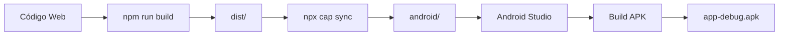

# 📱 GUIA RÁPIDO - GERAR APK ANDROID

## ⚡ **3 PASSOS SIMPLES**

---

## ✅ **CAPACITOR JÁ ESTÁ INSTALADO E CONFIGURADO!**

---

## 🚀 **MÉTODO 1: SCRIPT AUTOMÁTICO (MAIS FÁCIL)**

### Execute este comando:

```bash
.\build-android.ps1
```

**O script fará:**
1. ✅ Build do projeto web
2. ✅ Sync com Android
3. ✅ Abrirá o Android Studio

**Depois no Android Studio:**
1. Aguarde Gradle Sync
2. **Build → Build APK**
3. Pegue o APK em: `android/app/build/outputs/apk/debug/app-debug.apk`

---

## 🎯 **MÉTODO 2: MANUAL (PASSO A PASSO)**

### **Passo 1: Build**
```bash
npm run build
```

### **Passo 2: Sync**
```bash
npx cap sync android
```

### **Passo 3: Abrir Android Studio**
```bash
npx cap open android
```

### **Passo 4: No Android Studio**
1. **Build** → **Build Bundle(s) / APK(s)** → **Build APK(s)**
2. Aguarde o build terminar
3. Clique em **"locate"** para ver o APK

**APK gerado em:**
```
android\app\build\outputs\apk\debug\app-debug.apk
```

---

## ⚠️ **PRÉ-REQUISITOS**

Você precisa ter instalado:

### **1. Android Studio** ⬇️
- Download: https://developer.android.com/studio
- Instale com as opções padrão

### **2. Java JDK** ⬇️
- JDK 11 ou superior
- O Android Studio já instala automaticamente

### **3. Configuração (Automática)**
- O Android Studio configura tudo automaticamente
- Apenas aceite as licenças quando solicitado

---

## 📦 **ESTRUTURA CRIADA**

```
app-list-compras/
├── android/                 ✅ Projeto Android nativo
│   ├── app/
│   │   └── build/
│   │       └── outputs/
│   │           └── apk/
│   │               └── debug/
│   │                   └── app-debug.apk  ⬅️ SEU APK!
│   └── ...
├── capacitor.config.json   ✅ Configuração Capacitor
└── dist/                   ✅ Build web
```

---

## 🔄 **FLUXO COMPLETO**



---

## 🎯 **AÇÕES RÁPIDAS**

### **Atualizar código no APK:**
```bash
npm run build
npx cap sync android
```
Depois rebuild no Android Studio

### **Limpar e rebuild:**
```bash
cd android
.\gradlew clean
.\gradlew assembleDebug
cd ..
```

### **Instalar APK no celular:**
```bash
adb install android\app\build\outputs\apk\debug\app-debug.apk
```

---

## 📱 **TESTAR O APK**

### **Opção 1: Celular via USB**
1. Habilite "Depuração USB" no Android
2. Conecte via USB
3. Execute:
   ```bash
   adb install android\app\build\outputs\apk\debug\app-debug.apk
   ```

### **Opção 2: Compartilhar arquivo**
1. Copie `app-debug.apk`
2. Envie por WhatsApp/Drive/Email
3. Instale no celular (habilite "Fontes desconhecidas")

### **Opção 3: Emulador**
1. No Android Studio: AVD Manager
2. Crie um dispositivo virtual
3. Execute o app

---

## 🐛 **PROBLEMAS COMUNS**

### **"Android SDK not found"**
✅ **Solução:** Instale Android Studio completo

### **"Gradle sync failed"**
✅ **Solução:**
```bash
cd android
.\gradlew clean
cd ..
```

### **"Build failed"**
✅ **Solução:**
```bash
npm run build
npx cap sync android
```
Depois rebuild no Android Studio

---

## 📊 **INFORMAÇÕES DO APK**

| Propriedade | Valor |
|-------------|-------|
| **Package ID** | com.listacompras.ia |
| **Nome** | Lista de Compras IA |
| **Versão** | 1.0.0 |
| **Tipo** | Debug (para testes) |
| **Tamanho** | ~5-10 MB |

---

## 🎨 **PERSONALIZAR**

### **Alterar nome:**
`android/app/src/main/res/values/strings.xml`

### **Alterar ícone:**
Substitua: `android/app/src/main/res/mipmap-*/ic_launcher.png`

### **Alterar versão:**
`android/app/build.gradle` → `versionCode` e `versionName`

---

## 🚀 **PUBLICAR NA PLAY STORE**

### **1. Gerar APK Release:**
```bash
cd android
.\gradlew assembleRelease
cd ..
```

### **2. Gerar App Bundle (AAB):**
```bash
cd android
.\gradlew bundleRelease
cd ..
```

### **3. Upload:**
- Play Console: https://play.google.com/console
- Upload o AAB (não APK!)
- Preencha informações
- Envie para revisão

**Veja guia completo:** `GERAR_APK_ANDROID.md`

---

## 📞 **COMANDOS ESSENCIAIS**

```bash
# Build completo em um comando
npm run build && npx cap sync android && npx cap open android

# Apenas abrir Android Studio
npx cap open android

# Gerar APK via comando (sem Android Studio)
cd android && .\gradlew assembleDebug && cd ..

# Ver dispositivos conectados
adb devices

# Instalar APK
adb install android\app\build\outputs\apk\debug\app-debug.apk
```

---

## 📚 **DOCUMENTAÇÃO**

| Documento | Descrição |
|-----------|-----------|
| `ANDROID_QUICK_START.md` | Este guia (início rápido) |
| `GERAR_APK_ANDROID.md` | Guia completo e detalhado |
| `build-android.ps1` | Script automático |

---

## ⚡ **COMEÇAR AGORA**

### **Execute:**

```bash
.\build-android.ps1
```

**OU**

```bash
npx cap open android
```

---

<div align="center">

## 🎉 **SUCESSO!**

**Seu app está pronto para virar APK Android!**

**Execute o script acima e em poucos minutos terá seu APK!**

---

**📱 Lista de Compras IA → APK Android → Google Play Store**

</div>
